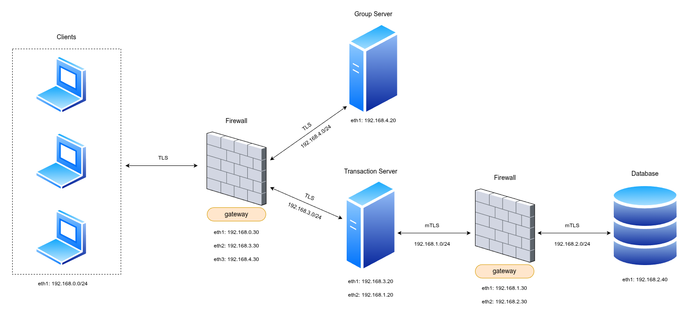

# ChainOfProduct Read Me

## Team

| Number | Name            | User                                 | E-mail                                        |
|--------|-----------------|--------------------------------------|-----------------------------------------------|
| 103396 | Lourenço Calhau | <https://github.com/lourenco-calhau> | <mailto:lourencocalhau@tecnico.ulisboa.pt>    | 
| 116178 | Nickolas Ficker | <https://github.com/Nick3301>        | <mailto:nickolas.ataide.f@tecnico.ulisboa.pt> |
| 106700 | Afonso Rosa     | <https://github.com/afonso215>       | <mailto:afonso.f.rosa@tecnico.ulisboa.pt>     |

  

## Contents

This repository contains documentation and source code for the *Network and Computer Security (SIRS)* project.

The [REPORT](REPORT.md) document provides a detailed overview of the key technical decisions and various components of
the implemented project.
It offers insights into the rationale behind these choices, the project's architecture, and the impact of these
decisions on the overall functionality and performance of the system.

This document presents installation and demonstration instructions.

## Installation

To see the project in action, it is necessary to setup a virtual environment, with 5 networks and 6 machines.

The following diagram shows the networks and machines:



The following table shows the adapters' configuration for the machines.

<div id="networks-table"></div>

| Machine Name                             | eth0 | eth1                       | eth2         | eth3         |
|:-----------------------------------------|:-----|:---------------------------|:-------------|:-------------|
| **Client**                               | NAT  | 192.168.0.x (default x=10) | X            | X            |
| **Client-Servers Firewall**              | NAT  | 192.168.0.30               | 192.168.3.30 | 192.168.4.30 |
| **Transaction Server**                   | NAT  | 192.168.3.20               | 192.168.1.20 | X            |
| **Group Server**                         | NAT  | 192.168.4.20               | X            | X            |
| **Transaction Server-Database Firewall** | NAT  | 192.168.1.30               | 192.168.2.30 | X            |
| **Database**                             | NAT  | 192.168.2.40               | X            | X            |

### Prerequisites

#### Installing Virtual Machines

To execute the whole system, you will need multiple Virtual Machines. Before configuring the machines, you will need
a way to run the VMs. We recommend using Virtual Box or VMWare. Follow the next steps so that you have one Virtual
Machine running on Kali Linux.

For VirtualBox (recommended for Windows and Linux running on x86 or x64 processors):

1. Download VirtualBox at [Virtual Box](https://www.virtualbox.org) official website;
2. Install VirtualBox following [instructions from the manual](https://www.virtualbox.org/manual/ch02.html);
3. Create a new Virtual Machine following
   the [Kali inside VirtualBox tutorial](https://www.kali.org/docs/virtualization/install-virtualbox-guest-vm/);

For VMWare (recommended for macOS running on Apple Silicon processors M1/M2/M3), you can follow the following tutorial
covering all the steps from obtaining the software to configuring
a Kali virtual machine.

- [VMWare set up tutorial](https://github.com/tecnico-sec/Setup/blob/master/VMwareFusion.md)

After having a Virtual Machine configured with an image of Kali Linux, follow the guide on how to install
the OS on the machine [here](https://github.com/tecnico-sec/Setup/blob/master/KaliSetup.md).

#### System specific dependencies

After having a Virtual Machine up and running Kali Linux, you will need to install software needed to execute the
system. First you will need to install JDK 21:

```sh
$ sudo apt update
$ apt-cache search openjdk | grep 21
$ sudo apt install openjdk-21-jdk -y

# Verify the installation
$ java --version
$ javac --version
```

Afterward, you will need to install Maven:

```sh
$ sudo apt install maven

# Verify the installation
$ mvn --version
```

After these two steps, your Virtual Machine will have both Java Developer Kit 21 and Maven 3.9.9 installed.

<div id="key-pair"></div>

The last pre-requisite is to have all the public and private keys that all the Clients will use to run the system. For
example, if the Clients that will use the system are `alice` and `bob`, before cloning the machines and executing 
the system, you will need to create the key-pairs of each of these users. We will mention how to execute this step 
on the next section.

Setup the first virtual machine running Kali Linux and ensure all the prerequisites before cloning it. The next
section of the guide walks you through the configuration of each virtual machine.

### Machine configurations

As mentioned before, you will need 5 networks and 6 machines to see the project working properly. More clients are
supported, meaning that each new running active client translates to a new virtual machine.

We recommend that you follow the order of steps we are providing so that you have a simple and clean setup on all the
machines running the system.

***Before the next steps, you must ensure the prerequisites.***

**Step 1**: Launch the Virtual Machine running Kali Linux.

**Step 2**: Clone the repository:

```sh
$ git clone https://github.com/tecnico-sec/A40-ChainOfProduct.git
```

**Step 2.1**: Create key-pairs for users:

As mentioned in the [pre-requisites](#key-pair), you will need to create the key-pairs for each user that will be executing 
the 
system. To do so, you can execute the following commands:

```sh
$ cd A40-ChainOfProduct/certs
$ openssl genrsa -out alice.key
# Convert the private key
$ openssl pkcs8 -topk8 -inform PEM -outform DER -in alice.key -out alice_private.der -nocrypt
# Generate the public key
$ openssl rsa -in alice.key -pubout -outform DER -out alice_public.der
```

This will create the key-pair for user `alice`. Ensure that all the users that will use the system will have 
previously executed this step. For example, if users `bob` and `charlie` will be executing the system, copy the same 
commands, changing every instance of `alice` to `bob` and `charlie` respectively.

**Step 3**: Shut down the Virtual Machine.

**Step 4**: Clone the Virtual Machine 5 + N times, N being the number of additional clients you want running on your
system. ***Ensure you generate new MAC addresses for each Virtual Machine***

**Step 5**: Configure the network adapters on each machine:

- Client(s)
    - Enable Adapter 2 and attach it to an Internal Network named `intnet_1`
- Firewall for Client-Servers interaction
    - Enable Adapter 2 and attach it to an Internal Network named `intnet_1`
    - Enable Adapter 3 and attach it to an Internal Network named `intnet_2`
    - Enable Adapter 4 and attach it to an Internal Network named `intnet_5`
- Transaction Server
    - Enable Adapter 2 and attach it to an Internal Network named `intnet_2`
    - Enable Adapter 3 and attach it to an Internal Network named `intnet_3`
- Group Server
    - Enable Adapter 2 and attach it to an Internal Network named `intnet_5`
- Firewall for Transaction Server &harr; Database interaction
    - Enable Adapter 2 and attach it to an Internal Network named `intnet_3`
    - Enable Adapter 3 and attach it to an Internal Network named `intnet_4`
- Database
    - Enable Adapter 2 and attach it to an Internal Network named `intnet_4`

*Keep Adapter 1 attached to NAT on all machines so that you have Internet access to install any missing dependency.*

**Step 6**: Boot the Virtual Machines.

**Step 7**: Run the network setup scripts:

When inside the directory to where the repository was cloned into, execute:

```sh
$ cd A40-ChainOfProduct/infra/scripts
```

For each Virtual Machine, there is a script that you can run to set up the networks. All the scripts have the same
format `setup_network_xxxxx.sh` where `xxxxx` is the corresponding machine type:

- `client`
- `firewall_client_server`
- `transaction_server`
- `group_server`
- `firewall_transaction_server_db`
- `db`

To execute the script:

```sh
$ chmod +x setup_network_xxxxx.sh
$ sudo ./setup_network_xxxxx.sh
```

To go back to the project root folder:

```sh
$ cd ../..
```

#### Creating new Clients

If you want to run more than one client, you have to change the network configuration file on each new Client
machine. You have to edit the `setup_network_client.sh` file at `infra/scripts`. Search for this section of the script:

```sh
# INTERNAL (Adapter 2 - Connects to Firewall)
auto eth1
iface eth1 inet static
    address 192.168.0.10
    netmask 255.255.255.0
EOF
```

Change the address `192.168.0.10` to `192.168.0.X` where X has to be a different number than 10 and 30 (the
firewall's host identifier). On each new Client, you have to change the host identifier so that each Virtual Machine
is correctly identified.

After editing and saving the new changes, you can follow execute the script to configure the networks normally.

#### Verify that the networks are correctly configured

When all the scripts are done executing, you can verify on each machine that the networks configuration is correct
by executing `ifconfig` on the terminal. You should be able to verify that the output of the command follows the
[configuration table](#networks-table) showing the global system's networks.

Next we have custom instructions for each machine.

#### Machine 1 - Client

This machine will run each Client instance, a simple Java client. It will run the code responsible for protecting,
unprotecting and verifying the transactions, creating authentication related requests (register and login), creating
requests
related to transactions (storing, fetching, sharing,
etc.) and requests related to groups (creating group, sharing with group, decrypting key for group, etc.).

The first step is to install the library created for securing documents and the common Java classes used to simplify
the communication between Clients and Servers. To do so, execute the following commands:

```sh
# Install library
$ cd library
$ mvn clean install
```

```sh
# Install common code
$ cd ../common
$ mvn clean install
```

After having all the dependencies installed, the next step is to compile and execute the Client code:

```sh
$ cd ../client
$ mvn clean compile
$ mvn exec:java
```

After compiling and executing the Client, you should see a prompt with the available commands the Client can
request to the server.

To stop the Client's execution, you can just execute the command `exit` presented in the prompt of available commands.

#### Machine 2 - Firewall between Clients and Main Server

This machine is responsible for being the firewall/gateway between the Clients and both Servers. Also, it works as a
gateway for the communication between the Transaction Server and the Group Server, as they are settled in different
subnets. It masks the IP address of the Servers, so that it keeps the Servers' IP hidden from the outside networks
and only allows for connections from a specific subnet (Internal Network `intnet_1`).

The configuration of this machine is already done by executing the script that configures the networks.

#### Machine 3 - Transaction Server

This machine is the one that will be executing the Transaction Server, running a simple Java server. It is
responsible for managing users and transactions, all in pair with the database.

Similarly to the Client machine, the first step is to install the necessary dependencies.

```sh
# Install library
$ cd library
$ mvn clean install
```

```sh
# Install common code
$ cd ../common
$ mvn clean install
```

After having all the dependencies installed, the next step is to compile and execute the Transaction Server code:

```sh
$ cd ../server
$ mvn clean compile
$ mvn exec:java
```

After initiating the Server, you should see a message saying:
`[TransactionServer] Server started with endpoints available at https://192.168.3.20:8443/`.

To stop the execution of the Server, you can press `ctrl + c` on your keyboard and the Server will shut down gracefully.

#### Machine 4 - Group Server

This machine is the one that will be executing the Group Server, also running a simple Java server. It is
responsible for managing groups, with their respective members, and providing the necessary information that the
Clients need for sharing/fetching transactions in the context of groups and not individual companies.

The Group Server also has the dependencies related to the common Objects that simplify communications and also
related to utils shared by the secured documents' library. To install both dependencies:

```sh
# Install library
$ cd library
$ mvn clean install
```

```sh
# Install common code
$ cd ../common
$ mvn clean install
```

After having all the dependencies installed, the next step is to compile and execute the Group Server code:

```sh
$ cd ../group-server
$ mvn clean compile
$ mvn exec:java
```

After initiating the Server, you should see a message saying:
`[GroupServer] Server started with endpoints available at https://192.168.4.20:8081/`.

To stop the execution of the Server, you can press `ctrl + c` on your keyboard and the Server will shut down gracefully.

#### Machine 5 - Firewall between Transaction Server and Database

This machine is responsible for being the firewall/gateway between the Transaction Server and the Database. For this
case, it doesn't mask the IP address of neither the services, as we consider them to be a sole system, but with each
individual service running on different subnets. The machine's responsibility is to only allow incoming packets from
the Server's IP address to be forwarded to the Database's IP address.

The configuration of this machine is already done by executing the script that configures the networks.

#### Machine 6 - Database

This machine runs a PostgreSQL 16 database inside a Docker container. It also has Docker and Docker Compose installed to
manage the container.

**Setup:**

As the communication channels between the database and the main server are using TLS to support security, first we need
to allow the container that will run the PostgreSQL database to be the only able to use the database private key.

For this effect, the first step in the database machine:

```sh
$ cd certs
$ sudo chown 999:999 db_server.key
$ sudo chmod 600 db_server.key
```

After setting the key permissions on the machine, you need to set up the execution of the database itself.

```sh
$ cd ../database
$ chmod +x init-database.sh
$ sudo ./init-database.sh
```

This will:

- Install Docker and Docker compose, if they are not already installed
- Enable and start the Docker service
- Launch the PostgreSQL container defined in the `docker-compose.yml` file

If you already have executed the setup, or it is not the first time launching the container, you can run the database
with:

```sh
$ sudo docker compose up -d
```

and to shut down the container:

```sh
$ sudo docker compose down
```

If you want to erase the volume containing the data stored to reset the database:

```sh
$ sudo docker compose down -v
```

next time you launch the container, the data will be fresh.

**To verify:**

```sh
$ sudo docker ps
```

You should see a container named `sirs_postgres` in the Up state, listening on port 5432.

**To test:**

```sh
$ sudo psql -h localhost -U sirs -d sirsdb
```

You should be prompted for a password (as defined in your `docker-compose.yml`) and then able to run:

```sh
sirsdb=# \dt
```

to list tables. Initially, only system tables will be present.

**Expected results:**

- Docker is running on your machine
- The container runs without errors
- The `psql` command connects successfully
- You can query the database

**Known problems:**

- If the password authentication fails on the `psql` command, make sure the password matches the one on the
  `docker-compose.yml` file.
- Commands like `docker` or `docker compose` not found or `systemctl start docker` fails
    - Make sure your system as a known package manager (`apt`, `dnf`, `yum`, etc.)
    - Follow the official Docker installation docs for your OS: https://docs.docker.com/engine/install/
- `docker ps` shows no containers running:
    - Make sure no other process is using port 5432
    - Remove old volumes if you need a clean start:
  ```sh
  $ sudo docker compose down -v
  $ sudo docker compose up -d
  ```
- If when executing `sudo docker ps` doesn't show any running container, most probably it's a fault on the
  authorization to use the private key of the database, used to implement TLS on the communications. Ensure you
  executed the commands that change permissions of the use of the private key.

## Demonstration

Now that all the networks and machines are up and running, we can run a small end-to-end scenario and how to observe the main security properties:

- [SR1] Confidentiality  
- [SR2] Authentication (who can share)  
- [SR3] Integrity 1 (transaction integrity)  
- [SR4] Integrity 2 (who shared with whom)

On the Client Machine, you will se an interactive propmt similar to:

```
Commands: register, login, store, fetch, sign, share, share-group,
create-group, group-add-member, group-remove-member, group-server-pubkey, group-ismember, exit
>
```

Here is where the client (seller/buyer/third party) can interact with the application. First of all, to be able to have access
to the services, the client must first login.

**1. Register the demo users:**

At the client prompt:
```
> register
Username: alice
Password: alicepw

> register
Username: bob
Password: bobpw

> register
Username: charlie
Password: charliepw
```

Note: any user can be registered here, however alice, bob and charlie already have their assymetric keys in the `/keys` directory.
If you wish to register another user, it will be necessary to generate their respective `username_private.der` and `username_public.der` keys.

**2. Create and store a protected transaction:**

We now create a transaction between `seller` and `buyer`.
First, we need to create a transaction JSON file in another terminal in the format:
```
$ cat > tx1.json << 'EOF'
{
  "id": "tx-001",
  "timestamp": 1734633600,
  "seller": "alice",
  "buyer": "bob",
  "product": "DisplayPanel",
  "units": 100,
  "amount": 5000
}
EOF
```
Keep in mind that the seller/buyer of the transaction must match your registered users.

To store the transaction, we must first login and then run:
```
> login
Username: alice
Password: alicepw

> store
Path to JSON transaction file: tx1.json
```
This will fail if the user logged in is not a part of the transaction.

When storing the transaction, the client library runs Protect.protect(...):

- Generates a fresh AES key K_tx.
- Computes a hash of the plaintext transaction.
- Encrypts { transaction, integrity_hash } with K_tx.
- Builds the secureDocument and signs it with the user’s private key (agreement signature).
- The signature is stored in the transaction metadata.
- K_tx is shared with seller and buyer, each wrapped with their public RSA key.

The Transaction Server verifies the seller’s agreement signature (Check.check) and, if valid, inserts the record in the database.
You should see `[STORE TRANSACTION] Success! Transaction stored.` in the client, and a corresponding log line in the server.

**3.1 Fetch as seller:**

Now both the seller and buyer can fetch the transaction with:

```
> fetch
Transaction ID: tx-001
```

If you are still logged in with the user who created it, the expected output is:

```
[FETCH+DECRYPT] Got transaction tx-001
Decrypted transaction:
  Sender:    alice
  Receiver:  bob
  Timestamp: 1734633600
  Seq num:   1
  Content:   {
  "id": "tx-001",
  "timestamp": 1734633600,
  "seller": "alice",
  "buyer": "bob",
  "product": "DisplayPanel",
  "units": 100,
  "amount": 5000
}

Agreement status:
  Your agreement signature (seller): VALID

[SHARE LOG] No individual share logs present in metadata.
[SHARE LOG] No group share logs present in metadata.
```
This contains the decrypted transaction, your agreement signature (which shows also the integrity of the transaction) and the share logs.

**3.2 Fetch as buyer:**

When fetching as the buyer of this transaction, the output is a bit different:

```
> login
Username: bob
Password: bobpw

> fetch
Transaction ID: tx-001
```

Expected output:
```
[FETCH+DECRYPT] Got transaction tx-001
Decrypted transaction:
  Sender:    alice
  Receiver:  bob
  Timestamp: 1734633600
  Seq num:   1
  Content:   {
  "id": "tx-001",
  "timestamp": 1734633600,
  "seller": "alice",
  "buyer": "bob",
  "product": "DisplayPanel",
  "units": 100,
  "amount": 5000
}

Agreement status:
  Your agreement signature (buyer): PENDING

[SHARE LOG] No individual share logs present in metadata.
[SHARE LOG] No group share logs present in metadata.
```
The agreement signature is pending, since the buyer did not sign this transaction yet.

**4. Signing the transaction as buyer:**

They buyer may sign the transaction with:

```
> sign
Transaction ID: tx-001
```

The client:
- Recomputes the canonical JSON of secureDocument.
- Signs it with the user’s (buyer) private key.
- Sends the signature to the server.

The server:
- Verifies the signature using Check.check(..).
- Stores it as buyerSignature in the metadata.

If everything checks out, the signature is stored and the client sees `[SIGN TRANSACTION] Signature sent successfully`.

Fetch again as buyer and you will see: `Agreement status: Your agreement signature (buyer): VALID`

**5.1 Sharing with a third party individual:**

Both the seller and buyer are allowed to share the transaction with a third party. This can be done with:

```
> login
Username: alice
Password: alicepw

> share
Transaction ID: tx-001
Share with (target company ID): charlie
```

The client:

- Derives K_tx from the user’s RSA key.
- Encrypts K_tx with the third party’s public key.
- Builds a ShareLog with: `sharedBy = alice` and `sharedWith = charlie`
- Signs over: `transactionId | txTimestamp | sharedBy | sharedWith`
- Sends ShareRequest to the server.

The server:

- Verifies that sharedBy matches the authenticated user and is seller/buyer (SR2).
- Verifies the share signature (prevents forged share logs).
- Stores the new ShareLog + SharedKey in metadata.

If you try to share the same transaction from any other user that is not seller/buyer, you should see a 403 Forbidden or 401 Unauthorized response.

**5.2 Fetching as a third party individual:**

Now that `tx-001` was shared with charlie, log in as charlie:

```
> login
Username: charlie
Password: charliepw

> fetch
Transaction ID: tx-001
```

Expected output:
```
[FETCH+DECRYPT] Got transaction tx-001
Decrypted transaction:
  Sender:    alice
  Receiver:  bob
  Timestamp: 1734633600
  Seq num:   1
  Content:   {
  "id": "tx-001",
  "timestamp": 1734633600,
  "seller": "alice",
  "buyer": "bob",
  "product": "DisplayPanel",
  "units": 100,
  "amount": 5000
}

Agreement status:
  Third party view: you do not hold agreement signatures.

[SHARE LOG] No individual share logs present in metadata.
[SHARE LOG] No group share logs present in metadata.
```

Key points:
- charlie can decrypt only because a SharedKey was created specifically for charlie (SR1).
- Third parties do not see the seller/buyer agreement signatures.
- Third parties do not see the share logs; those are visible to seller/buyer and used to enforce [SR4] from their perspective.

When fetching as they seller/buyer, we are able to see the shareLog:

```
> login
Username: bob
Password: bobpw

> fetch
Transaction ID: tx-001
```
The expected output is:

```
(...)
Agreement status:
  Your agreement signature (buyer): VALID

[SHARE LOG] Verifying individual share permissions:
  alice -> charlie : VALID
[SHARE LOG] No group share logs present in metadata.
```

**6.1 Sharing with a third party group of individuals:**

We are now show sharing to a group with the help of the Group Server. Again, only the seller and buyer are allowed to share the transaction with a group. This can be done with:

```
> login
Username: alice
Password: alicepw

> create-group
Group name: auditors
Members (comma-separated usernames): charlie
```

You can also check membership:
```
> group-ismember
Group name: auditors
Username: charlie
```
You should see:
```
[GROUP SERVER] Membership: user charlie in auditors -> true
Member status for 'charlie' in group 'auditors': true
```

Now, we can create a new transaction which was not shared previously with charlie:
```
$ cat > tx2.json << 'EOF'
{
  "id": "tx-002",
  "timestamp": 1734633600,
  "seller": "alice",
  "buyer": "bob",
  "product": "DisplayPanel",
  "units": 100,
  "amount": 5000
}
EOF
```

Now we can store this new transaction and sign as the buyer again:
```
> store
Path to JSON transaction file: tx2.json

> login
Username: bob
Password: bobpw

> sign
Transaction ID: tx-002
```

The transaction can then be shared with the group `auditors`:
```
> share-group
Transaction ID: tx-002
Share with group (group name): auditors
```
If successful, you should see the message:
```
[GROUP SERVER] Public key fetched from group server.
[SHARE-GROUP] Transaction shared with group 'auditors' successfully.
```

The client:
- Derives K_tx.
- Obtains the Group Server public key (group-server-pubkey internally).
- Encrypts a payload containing { groupName, K_tx } with the Group Server public key.
- Builds a ShareLog with sharedBy = bob, sharedWith = auditors.
- Signs over: transactionId | txTimestamp | sharedBy | groupName.
- Sends the ShareRequest (group ShareLog + group SharedKey) to the Transaction Server.

The server:
- Verifies the share signature.
- Stores the group share log and group-encrypted key.

**6.2 Fetching as a third party individual of a group:**

Now that `tx-002` was shared with `auditors`, log in as charlie:

```
> login
Username: charlie
Password: charliepw

> fetch
Transaction ID: tx-002
```

Expected output:
```
[FETCH+DECRYPT] Got transaction tx-002
Decrypted transaction:
  Sender:    alice
  Receiver:  bob
  Timestamp: 1734633600
  Seq num:   1
  Content:   {
  "id": "tx-002",
  "timestamp": 1734633600,
  "seller": "alice",
  "buyer": "bob",
  "product": "DisplayPanel",
  "units": 100,
  "amount": 5000
}

Agreement status:
  Third party view: you do not hold agreement signatures.

[SHARE LOG] No individual share logs present in metadata.
[SHARE LOG] No group share logs present in metadata.
```

However if charlie is removed from the group, he no longer has access to `tx-002`:
```
> login
Username: bob
Password: bobpw

> group-remove-member
Group name: auditors
Username to remove: charlie

> login
Username: charlie
Password: charliepw

> fetch
Transaction ID: tx-002
```

The expected output in the client is: `[FETCH+DECRYPT] Failed: 403`, while the TransactionServer prints:
```
[ServerResource] Fetch transaction request received for the transaction: 'tx-002'
[GroupServerClient] Sending request to Group Server: isInGroups for user: 'charlie'
[GroupServerClient] Member not found in any group
[ServerResource] Access denied for user charlie
```

The server checked if charlie is a member of the group `auditors` and then denied access.

## SecureDocuments Library

A Java cryptographic library for protecting, verifying, and unprotecting documents using hybrid encryption (AES-256 +
RSA-2048) with digital signatures. Can be used as a standalone tool via its command-line interface or integrated into
other projects.

### Features

- **Protect**: Encrypt documents with AES-256 and sign with RSA digital signatures
- **Check**: Verify document signatures to ensure authenticity
- **Unprotect**: Decrypt and verify document integrity

### Building the Library

Build the executable JAR with all dependencies:

```bash
cd library
mvn clean package
cd ..
```

This creates `library/target/securedocs.jar` ready to use.

### CLI Usage

#### Document Format

Input documents must be JSON files with the following required fields:

```json
{
  "sender": "alice",
  "receiver": "bob",
  "timestamp": "2025-12-20T10:30:00Z",
  "seq_num": 1,
  "content": "Your document content as a string"
}
```

#### Running Commands

```bash
cd library
./securedocs <command> [arguments]
```

The `securedocs` script automatically locates the JAR file and runs it.

#### Available Commands

##### 1. Protect a Document

Encrypts a document and generates cryptographic signatures. All outputs are saved to `output/` directory with filenames
derived from the input file.

```bash
./securedocs protect <input-file> <sender-private-key>
```

**Example:**

```bash
cd library
./securedocs protect transaction.json ../keys/alice_private.der
```

**Output:** Creates three files in `output/`:

- `transaction_secure.json` - The encrypted and signed document
- `transaction_signature.txt` - The RSA signature
- `transaction_key.b64` - The AES key (Base64-encoded) needed for decryption

##### 2. Check Document Signature

Verifies the authenticity of a protected document.

```bash
./securedocs check <secure-doc> <signature> <sender-public-key>
```

**Example:**

```bash
cd library
./securedocs check output/transaction_secure.json output/transaction_signature.txt ../keys/alice_public.der
```

**Exit Codes:**

- `0` - Signature is valid
- `1` - Signature is invalid or verification failed

##### 3. Unprotect a Document

Decrypts a document and verifies its integrity. Output is saved to `output/` directory with its filename derived from
the secure document.

```bash
./securedocs unprotect <secure-doc> <signature> <transaction-key> <sender-public-key>
```

**Example:**

```bash
cd library
./securedocs unprotect output/transaction_secure.json output/transaction_signature.txt output/transaction_key.b64 ../keys/alice_public.der
```

**Output:** Creates `output/transaction.json` (original decrypted document)

##### 4. Help

Display usage information:

```bash
./securedocs help
```

## Additional Information

### Links to Used Tools and Libraries

- [Kali Linux](https://www.kali.org/)
- [Java Developer Kit (Open JDK) 21](https://openjdk.java.net/)
- [Maven 3.9.9](https://maven.apache.org/)
- [Docker](https://www.docker.com/)
- [Docker Compose](https://docs.docker.com/compose/)
- [PostgreSQL 16](https://www.postgresql.org/docs/16/index.html)

### Versioning

We use [SemVer](http://semver.org/) for versioning.

### License

This project is licensed under the MIT License - see the [LICENSE.txt](LICENSE.txt) for details.

----
END OF README
